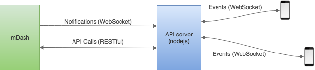

# Full IoT product: smart light on Mongoose OS

This repository contains the implementation of the full, functional commercial IoT product under a commercial-friendly Apache 2.0 license.
It utilises the power of [Mongoose OS](https://mongoose-os.com) and can be used as a reference for creating similar smart products.

This project implements a smart light. For the hardware, we use a development board with an LED, which serves as a light. The devboard can be
"shipped" to a customer. A customer provisions it using a mobile app.
You, as a vendor, have full control
over all "shipped" products, including device
dashboard with remote firmware updates, remote management and usage statistics.

This short video demonstrates the use case:

TBD

## Step-by-step usage guide

1. Get a hardware device. We simulate a real smart lite with one of the
   supported development boards - choose one from https://mongoose-os.com/docs/quickstart/devboards.md. The built-in LED
   on the devboard will act as a light. Alternatively, you can put together
   your own hardware setup, just make sure to alter `firmware/mos.yml` to set
   the GPIO pin number for the LED.
2. Follow https://mongoose-os.com/software.html to
   install `mos`, a Mongoose OS command-line tool.
3. Clone this repository:
   ```
   git clone https://github.com/cesanta/mongoose-os-smart-light
   ```
5. Install [Docker Compose](https://docs.docker.com/compose/) and
   start the backend on your workstation (or any other machine):
   ```
   cd backend
   docker-compose build
   docker-compose up
   ```
   NOTE: on MacOS, make sure to use Docker for Mac (not Docker toolbox),
   see https://docs.docker.com/docker-for-mac/docker-toolbox/. That is
   required cause Docker toolbox installation on Mac requires extra steps
   to forward opened ports.
6. Connect your device to your workstation via a USB cable. Build and
   flash the device:
   ```
   cd mongoose-os-smart-light/firmware
   mos build --platform YOUR_PLATFORM --local --verbose  # esp32, cc3220, stm32, esp8266
   mos flash
   ```
8. Register a new device on a management dashboard, obtain ID and TOKEN:
   ```
   $ curl -d '{}' -u admin:admin http://YOUR_WORKSTATION_IP:8009/api/v2/devices
   {
     ...
     "id": "...........",
     "token": "..........",
     ...
   }
   ```
   If you login to the dash at http://YOUR_WORKSTATION_IP:8009 with
   username/password `admin/admin`, you should be able to see your new device.
9. Factory-configure your device, and pre-provision it on a dashboard:
   ```
   mos config-set --no-reboot device.id=ID
   mos config-set --no-reboot dash.token=TOKEN
   mos config-set --no-reboot dash.server=ws://YOUR_WORKSTATION_IP:8009/api/v2/rpc
   mos config-set --no-reboot conf_acl=wifi.*,device.*,dash.enable
   mos call FS.Rename '{"src": "conf9.json", "dst": "conf5.json"}'
   mos call Sys.Reboot
   ```
   The `mos config-set` commands generates `conf9.json` file on a device.
   The `mos call FS.Rename` renames it to `conf5.json`, in order to make this
   configuration immune to factory reset and OTA. The only way to re-configure
   these settings is to reflash the device, or remove `conf5.json`.

10. "Ship" a device to a "customer". Start a browser on your mobile app,
   open http://YOUR_WORKSTATION_IP:8008. Press on the "Add device" button,
   and follow provisioning instructions.

11. When a newly provisioned device appears on the list, switch it on/off.

12. In order to re-provision, press on the "user button" and hold it for
    more than 3 seconds. That will reset the device to factory defaults.
    The reset functionality is provided by the `provision` Mongoose OS library.

## General Architecture

The backend is installed on your workstation (so called on-premises
installation). It is completely self-contained, not requiring any external
service to run, and run as a collection of Docker images (docker-compose).
Thus, such backend could be run on any server, e.g. as a AWS EC2 instance,
Google Cloud instance, etc.


Device management backend is mDash (the same that runs on
https://dash.mongoose-os.com), the frontend is a PWA (progressive web app).
Both are behind Nginx, which terminates SSL from devices and mobile apps.
For the sake of simplicity, the SSL certificate management is avoided, and
this reference plain WebSocket communication rather than WSS. For the
production, SSL should be turned on.


The mobile app talks with the API server over WebSocket, sending and
receiving JSON events. Switching the light on/off sends
`{"name:"on", "data":{"id":.., "on": true/false}}` event.
An API server catches it, and talks to mDash to modify the "desired"
device shadow state for the device with corresponding ID,
`{"desired": {"on": true/false}}`.
The device shadow generates a delta, which is sent to a device. A device code
reacts to the delta, switches the light on or off, and updates the shadow,
setting the "reported" state: `{"reported": {"on": true/false}}`.
Shadow update clears the delta, and triggers a notification from mDash.
API server catches the notification, and forwards it to the mobile app. 
A mobile app reacts, refreshes device list,
and sets the on/off GUI control according to the device shadow.

That implements a canonic pattern for using a device shadow - the same logic
can be used with backends like AWS IoT device shadow,
Microsoft Azure device twin, etc. Note how device shadow changes when
user switches the lights on/off. Also note that if the device comes online,
it synchronises with the shadow, switching on/off according to the
`desired.on` setting.


## Backend

The mDash comes pre-configured with a single administrator user `admin`
(password `admin`). That was done with the following command:

```
docker-compose run dash /dash --config-file /data/dash_config.json --register-user admin admin
```

The resulting `backend/data/db.json` mDash database was committed to
the repo. The API key, automatically created for the admin user, is used
by the API Server for all API Server <-> mDash communication, and specified
as the `--token` flag in the `backend/docker-compose.yml` file. Thus,
the API Server talks to the mDash with the administrative privileges.

## Device provisioning process

Adding new device is implemented by the Mobile app (PWA) in 3 steps:

1. Customer is asked to join the WiFi network called `Mongoose-OS-Smart-Light`
   and set device name. A new device, when shipped to the customer,
   starts a WiFi access point, and has a pre-defined IP address `192.168.4.1`.
   The app calls device's RPC function `Config.Set`, saving entered
   device name into the `device.password` configuration variable.
2. Customer is asked to enter WiFi name/password. 
   The app calls device's RPC function `Config.Set` to set
   `wifi.sta.{ssid,pass,enable}` configuration variables, and then calls
   `Config.Save` function to save the config and reboot the device.
   After the reboot, a device joins home WiFi network, and starts the
   DNS-SD service, making itself visible as `mongoose-os-smart-light.local`.
3. Customer is asked to join home WiFi network and press the button to
   finish registration process. The app calls `Config.Set` and `Config.Save`
   RPCs to disable local webserver on a device, and the DNS-SD service.
   Then it sends `pair` Websocket message to the API server, asking to
   associate the device with the particular mobile APP (via the generated app ID).
   The API server registers the app ID as a user on mDash,
   and sets the `shared_with` device attribute equal to the app ID.

Thus, all devices are owned by the admin user, but the pairing process
shares a device with the particular mobile app. Therefore, when an API
server lists devices on behalf of the mobile app, all shared devices are
returned back.

## Mongoose OS - based firmware

The firmware source code lives in [firmware/](https://github.com/cesanta/mongoose-os-smart-light/tree/master/firmware).
This is a simple Mongoose OS application, that contains a
[firmware/mos.yml](https://github.com/cesanta/mongoose-os-smart-light/blob/master/firmware/mos.yml) build
file and [firmware/src/main.c](https://github.com/cesanta/mongoose-os-smart-light/blob/master/firmware/src/main.c) source file.

The bulk of the firmware functionality is provided by the Mongoose OS libraries,
listed in the `mos.yml` file:

```yml
libs:
  - origin: https://github.com/mongoose-os-libs/ca-bundle
  - origin: https://github.com/mongoose-os-libs/core
  - origin: https://github.com/mongoose-os-libs/dash
  - origin: https://github.com/mongoose-os-libs/dns-sd
  - origin: https://github.com/mongoose-os-libs/http-server
  - origin: https://github.com/mongoose-os-libs/provision
  - origin: https://github.com/mongoose-os-libs/rpc-service-config
  - origin: https://github.com/mongoose-os-libs/rpc-service-fs
  - origin: https://github.com/mongoose-os-libs/rpc-service-ota
  - origin: https://github.com/mongoose-os-libs/rpc-service-wifi
  - origin: https://github.com/mongoose-os-libs/rpc-uart
  - origin: https://github.com/mongoose-os-libs/ota-http-server
  - origin: https://github.com/mongoose-os-libs/ota-shadow
  - origin: https://github.com/mongoose-os-libs/wifi
```

Also, `mos.yml` file defines custom configuration parameters: the GPIO
pin number for the light LED, and a boolean setting whether that GPIO pin
is inverted or not:

```yml
  - ["smartlight", "o", {title: "My app custom settings"}]
  - ["smartlight.pin", "i", 2, {title: "Light GPIO pin"}]
  - ["smartlight.inverted", "b", true, {title: "True for ESP32 & ESP8266"}]
```

The `main.c` file contains a canonical device shadow logic. It reports
lights state when connected to the shadow, and reacts on the shadow delta.
The whole source code is only one page long. It is pretty descriptive and
easily understood.

The `mgos_app_init()` function sets up shadow handlers:

```c
enum mgos_app_init_result mgos_app_init(void) {
  mgos_event_add_handler(MGOS_SHADOW_UPDATE_DELTA, delta_cb, NULL);
  mgos_event_add_handler(MGOS_SHADOW_CONNECTED, connected_cb, NULL);
  return MGOS_APP_INIT_SUCCESS;
}
```

The `connected_cb()` handler reports current state to the backend.
The `delta_cb()` catches new delta, applies it, and reports the new state.


## Mobile app

The mobile app is a Progressive Web App (PWA). It is written in
[preact](https://preactjs.com/) and [bootstrap](https://getbootstrap.com/).
The main app logic is in a signle source file,
[backend/mobile-app/js/app.jsx](https://github.com/cesanta/mongoose-os-smart-light/blob/master/backend/mobile-app/js/app.jsx)
In order to avoid a separate build step, the app uses a prebuilt babel
transpiler.

When first downloaded and run on a mobile phone or desktop browser,
an app generates a unique ID and sets an `app_id` cookie. The `app_id`
cookie is used to authenticate the mobile phone with the
API server. The API server creates a user on the mDash for that `app_id`.
Basically, an API server trusts each new connection with a new `app_id`
that it is a new mobile app client, and creates a user for it. This simple
authentication schema allows to avoid user login/password step, but
is also suboptimal, cause it binds a user to a specific device. If,
for some reason, cookies get cleared, then all devices must be re-paired.

That was done deliberately to skip the user login step, as it is not
crucial for this reference implementation. Those who want to implement
password based user auth, can easily do so, for it is well known and understood.

When started, the app creates a WebSocket connection to the API Server, and
all communication is performed as an exchange of WebSocket messages. Each
message is an "event", which is a single JSON object with two attributes:
`name` and `data`. The API Server receives events, and may send events in
return. There is no request/response pattern, however. The communication
is "fire and forget" events.

The events sent by the app are:

- `{"name": "list"}` - request to send device list
- `{"name": "pair", "data":{"id":...}}` - request to pair a device with the app

The events sent by the API Server are:
- `{"name": "list", "data": [...]}` - list of devices, exactly as returned by mDash - see
   [mDash API](https://mongoose-os.com/docs/userguide/dashboard.md#rest-api-reference).
   The device object contains device shadow. The GUI toggle button is
   set according to the `device.shadow.reported.on` property.
- `{"name": "pair", "data": {"id": ...}}` - sent when a device with a given
  ID was paired. Pairing means setting `device.shared_with` device property
  on mDash.
- All notifications that are sent by mDash to the API Server are forwarded by
  the API Server to the mobile app for the paired devices. Specifically,
  the `online`, `offline`, and `rpc.out.Dash.Shadow.Update` notifications
  trigger device list refresh on the mobile app.

## API Server

The API Server is a simple NodeJS application. All code is in
[backend/api-server/main.js](https://github.com/cesanta/mongoose-os-smart-light/blob/master/backend/api-server/main.js).
The API Server opens a permanent WebSocket connection to mDash to
catch all notifications (see [mDash notifications](https://mongoose-os.com/docs/userguide/dashboard.md#notifications)).
To respond to the mobile app events, the API Server calls mDash via the
RESTful API.



## mDash management dashboard

mDash is an IoT backend with device management, desinged specifically
for Mongoose OS - built devices. It is extensively documented at
https://mongoose-os.com/docs/userguide/dashboard.md.

mDash is distributed by Cesanta as a standalone docker image that could be
run on-premises, as well as a hosted service https://dash.mongoose-os.com.
For this reference product, mDash is running standalone.

mDash's job is to terminate all device communication, provide notifications
and management capabilities - like OTA updates, etc.

mDash can be run anywhere: `docker run mgos/dash`. By default, it has
a restriction on the maximum number of users (5 maximum). In order to
remove the restriction for the production usage,
[contact us](https://mongoose-os.com/contact.html) for a production license.

## Usage statistics and analytics

The API Server receives notifications for all devices from the mDash.
They get stored in a plain text file, `backend/data/notification.log`, which
can be used for the further analytics. Multiple options are available,
for example uploading that data to the one of the well-known analytics
engines, provided by Google Cloud, Amazon AWS, Microsoft Azure, etc.

Since the particular analytics solution depends on the product, we leave
it there.


## Contact

Please [contact us](https://mongoose-os.com/contact.html) if you would like
our team to customise this reference for your product. That includes
customisation of the firmware, the backend, the mobile app.
