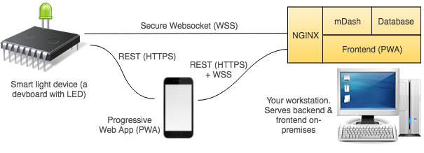

# Full IoT product: smart light on Mongoose OS

This repository contains the implementation of the full, functional commercial IoT product under a commercial-friendly Apache 2.0 license.
It utilises the power of [Mongoose OS](https://mongoose-os.com) and can be used as a reference for creating similar smart products.

This project implements a smart light. For the hardware, we use a development board with an LED, which serves as a light. The devboard can be
"shipped" to a customer. A customer provisions it using a mobile app.
You, as a vendor, have full control
over all "shipped" products, including device
dashboard with remote firmware updates, remote management and usage statistics.

This short video demonstrates the use case:

TBD

## Step-by-step usage guide

1. Get a hardware device. We simulate a real smart lite with one of the
   supported development boards - choose one from https://mongoose-os.com/docs/quickstart/devboards.md. The built-in LED
   on the devboard will act as a light. Alternatively, you can put together
   your own hardware setup, just make sure to alter `firmware/mos.yml` to set
   the GPIO pin number for the LED.
2. Follow https://mongoose-os.com/software.html to
   install `mos`, a Mongoose OS command-line tool.
3. Clone this repository:
   ```
   git clone https://github.com/cesanta/mongoose-os-smart-light
   ```
5. Install [Docker Compose](https://docs.docker.com/compose/) and
   start the backend on your workstation (or any other machine):
   ```
   cd backend
   docker-compose build
   docker-compose up
   ```
   NOTE: on MacOS, make sure to use Docker for Mac (not Docker toolbox),
   see https://docs.docker.com/docker-for-mac/docker-toolbox/. That is
   required cause Docker toolbox installation on Mac requires extra steps
   to forward opened ports.
6. Connect your device to your workstation via a USB cable. Build and
   flash the device:
   ```
   cd mongoose-os-smart-light/firmware
   mos build --platform YOUR_PLATFORM  # esp32, cc3220, stm32, esp8266
   mos flash
   ```
8. Register a new device on a management dashboard, obtain access token:
   ```
   $ curl -d '{}' -u admin:admin http://YOUR_WORKSTATION_IP:8009/api/v2/devices
   {
     ...
     "id": "...........",
     "token": "..........",
     ...
   }
   ```
   If you login to the dash at http://YOUR_WORKSTATION_IP:8009 with
   username/password `admin/admin`, you should be able to see your new device.
9. Factory-configure your device, and pre-provision it on a dashboard:
   ```
   mos config-set --no-reboot device.id=GENERATED_DEVICE_ID
   mos config-set --no-reboot dash.token=ACCESS_TOKEN
   mos config-set --no-reboot dash.server=ws://YOUR_WORKSTATION_IP:8009/api/v2/rpc
   mos config-set --no-reboot conf_acl=wifi.*,device.*,dash.enable
   mos call FS.Rename '{"src": "conf9.json", "dst": "conf5.json"}'
   ```
   The `mos config-set` commands generates `conf9.json` file on a device.
   The `mos call FS.Rename` renames it to `conf5.json`, in order to make this
   configuration immune to factory reset and OTA. The only way to re-configure
   these settings is to reflash the device, or remove `conf5.json`.


## General Architecture

The backend is installed on your workstation (so called on-premises
installation). It is completely self-contained, not requiring any external
service to run, and run as a collection of Docker images (docker-compose).
Thus, such backend could be run on any server, e.g. as a AWS EC2 instance,
Google Cloud instance, etc.


Device management backend is mDash (the same that runs on
https://dash.mongoose-os.com), the frontend is a PWA (progressive web app).
Both are behind Nginx, which terminates SSL from devices and mobile apps.



## Backend

The mDash comes pre-configured with a single administrator user `admin`
(password `admin`). That was done with the following command:

```
docker-compose run dash /dash --config-file /data/dash_config.json --register-user admin admin
```

The resulting `backend/data/dash_db.json` mDash database was committed to
the repo. The API key, automatically created for the admin user, is used
by the API Server for all API Server <-> mDash communication, and specified
as the `--token` flag in the `backend/docker-compose.yml` file. Thus,
the API Server talks to the mDash with the administrative privileges.

## Device provisioning process

Adding new device is implemented by the Mobile app (PWA) in 3 steps:

1. Customer is asked to join the WiFi network called `Mongoose-OS-Smart-Light`
   and set device name. A new device, when shipped to the customer,
   starts a WiFi access point, and has a pre-defined IP address `192.168.4.1`.
   The app calls device's RPC function `Config.Set`, saving entered
   device name into the `device.password` configuration variable.
2. Customer is asked to enter WiFi name/password. 
   The app calls device's RPC function `Config.Set` to set
   `wifi.sta.{ssid,pass,enable}` configuration variables, and then calls
   `Config.Save` function to save the config and reboot the device.
   After the reboot, a device joins home WiFi network, and starts the
   DNS-SD service, making itself visible as `mongoose-os-smart-light.local`.
3. Customer is asked to join home WiFi network and press the button to
   finish registration process. The app calls `Config.Set` and `Config.Save`
   RPCs to disable local webserver on a device, and the DNS-SD service.
   Then it sends `pair` Websocket message to the API server, asking to
   associate the device with the particular mobile APP (via the generated app ID).
   The API server registers the app ID as a user on mDash,
   and sets the `shared_with` device attribute equal to the app ID.

Thus, all devices are owned by the admin user, but the pairing process
shares a device with the particular mobile app. Therefore, when an API
server lists devices on behalf of the mobile app, all shared devices are
returned back.


## Mobile app

The mobile app is a Progressive Web App (PWA). When first downloaded and run
on a mobile phone or desktop browser, it generates a unique ID, and sets
a cookie `app_id`, which is used to authenticate the mobile phone with the
API server. The API server creates a user on the mDash for that `app_id`.

## Mongoose OS - based firmware

## Device dashboard

## Usage statistics and analytics
